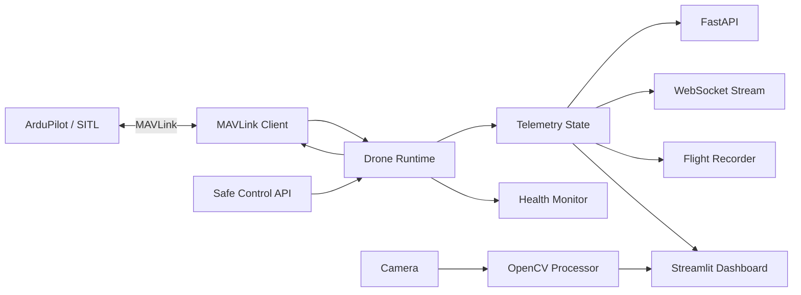

<div align="center">

# 🚁 SkySentinel — Python Drone Control & Real-Time Monitoring System

### MAVLink • ArduPilot • FastAPI • WebSocket • OpenCV • Streamlit • Flight Analytics


**A simulator-first ground-control and telemetry platform built in Python for ArduPilot vehicles.**

</div>

---

## 🚀 Project Overview

SkySentinel is an advanced Python-based drone monitoring and control system built around the MAVLink protocol and ArduPilot.

It connects to an ArduPilot vehicle or SITL simulator, continuously reads telemetry, maintains a thread-safe real-time vehicle state, exposes REST and WebSocket APIs, visualizes flight data in a live dashboard, records telemetry for replay, and processes camera frames with OpenCV.

The project is intentionally **SITL-first**. Actuation commands are disabled by default and must be explicitly enabled through configuration.

---

## ✨ Features

### Real-Time Telemetry
- GPS latitude / longitude
- Relative and MSL altitude
- Ground speed and airspeed
- Heading
- Roll / pitch / yaw
- Battery voltage, current and remaining %
- GPS satellite count and fix type
- Flight mode
- Armed / disarmed state
- Heartbeat age
- System status

### Live Monitoring
- Streamlit ground-control dashboard
- FastAPI REST endpoints
- WebSocket telemetry stream
- Live altitude / speed / battery charts
- GPS position panel
- Health and warning panel
- Connection status

### Safe Drone Controls
- Flight mode change
- Arm
- Disarm
- RTL
- Land
- SITL-only takeoff helper
- Command acknowledgement handling
- Global `ALLOW_ACTUATION=false` safety gate
- Configurable maximum takeoff altitude

### Flight Safety & Health
- Low-battery warnings
- Critical-battery warnings
- GPS quality warnings
- Lost-heartbeat detection
- Altitude-limit warning
- Stale telemetry detection

### Flight Data
- CSV telemetry recording
- JSON event log
- Replay utility
- Session timestamping
- Structured telemetry models

### Computer Vision
- OpenCV camera capture
- FPS measurement
- Brightness estimation
- Edge-density analysis
- Optional frame recording
- JPEG frame endpoint-ready architecture

### Engineering
- Modular Python package
- Environment-based configuration
- Logging
- Unit tests
- GitHub Actions CI
- Docker support
- Simulator-first workflow

---

## 🏗️ Architecture



---

## 📁 Project Structure

```text
SkySentinel-Drone-Control-Monitoring/
├── apps/
│   ├── api.py
│   └── dashboard.py
│
├── skysentinel/
│   ├── config.py
│   ├── runtime.py
│   ├── models.py
│   │
│   ├── mavlink/
│   │   ├── client.py
│   │   └── controller.py
│   │
│   ├── telemetry/
│   │   ├── parser.py
│   │   ├── state.py
│   │   ├── health.py
│   │   └── recorder.py
│   │
│   └── vision/
│       └── camera.py
│
├── scripts/
│   ├── run_api.py
│   └── replay_log.py
│
├── tests/
│   ├── test_health.py
│   └── test_parser.py
│
├── deploy/
│   ├── Dockerfile
│   └── docker-compose.yml
│
├── logs/
│   └── .gitkeep
│
├── .github/workflows/ci.yml
├── .env.example
├── .gitignore
├── requirements.txt
├── LICENSE
└── README.md
```

---

## 🧰 Tech Stack

| Layer | Technology |
|---|---|
| Language | Python |
| Flight protocol | MAVLink |
| Autopilot | ArduPilot |
| MAVLink SDK | pymavlink |
| API | FastAPI |
| Realtime transport | WebSocket |
| Dashboard | Streamlit |
| Vision | OpenCV + NumPy |
| Charts | Plotly |
| Logging | CSV + JSON |
| Testing | pytest |
| CI | GitHub Actions |
| Container | Docker |

---

# ⚙️ Setup

## 1. Clone

```bash
git clone https://github.com/ayansayyad7000-png/SkySentinel-Drone-Control-Monitoring.git
cd SkySentinel-Drone-Control-Monitoring
```

## 2. Create virtual environment

### Windows

```powershell
python -m venv .venv
.venv\Scripts\activate
```

### Ubuntu / Linux

```bash
python3 -m venv .venv
source .venv/bin/activate
```

## 3. Install dependencies

```bash
pip install -r requirements.txt
```

## 4. Configure

Windows:

```powershell
copy .env.example .env
```

Linux:

```bash
cp .env.example .env
```

Default:

```env
MAVLINK_CONNECTION=udp:127.0.0.1:14550
MAVLINK_BAUD=57600
ALLOW_ACTUATION=false
MAX_TAKEOFF_ALT_M=20
LOW_BATTERY_PERCENT=25
CRITICAL_BATTERY_PERCENT=15
MAX_ALTITUDE_WARNING_M=120
CAMERA_SOURCE=0
```

---

# 🧪 Recommended: Run with ArduPilot SITL

Use ArduPilot SITL and connect the Python application to:

```text
udp:127.0.0.1:14550
```

The system waits for a MAVLink heartbeat, then requests important telemetry streams.

> Keep `ALLOW_ACTUATION=false` while first testing the dashboard and telemetry path.

---

# ⚡ Run FastAPI

```bash
python scripts/run_api.py
```

or:

```bash
uvicorn apps.api:app --host 0.0.0.0 --port 8000 --reload
```

API docs:

```text
http://127.0.0.1:8000/docs
```

Health:

```text
GET /health
```

Telemetry:

```text
GET /telemetry
```

WebSocket:

```text
ws://127.0.0.1:8000/ws/telemetry
```

---

# 🖥️ Run Dashboard

```bash
streamlit run apps/dashboard.py
```

Open:

```text
http://localhost:8501
```

---

# 🎮 Safe Control API

Actuation is disabled by default.

To enable commands in a SITL test environment:

```env
ALLOW_ACTUATION=true
```

Available endpoints:

```text
POST /control/mode/{mode}
POST /control/arm
POST /control/disarm
POST /control/rtl
POST /control/land
POST /control/takeoff?altitude_m=5
```

Takeoff is limited by:

```env
MAX_TAKEOFF_ALT_M=20
```

---

# 📡 Telemetry Messages Used

SkySentinel consumes common ArduPilot MAVLink telemetry including:

```text
HEARTBEAT
GLOBAL_POSITION_INT
GPS_RAW_INT
SYS_STATUS
BATTERY_STATUS
VFR_HUD
ATTITUDE
```

The client also uses `MAV_CMD_SET_MESSAGE_INTERVAL` to request selected messages at controlled rates when supported by the autopilot.

---

# 📊 Example Telemetry Object

```json
{
  "connected": true,
  "armed": false,
  "flight_mode": "LOITER",
  "latitude": 18.5204,
  "longitude": 73.8567,
  "relative_altitude_m": 12.4,
  "groundspeed_m_s": 2.1,
  "heading_deg": 182,
  "battery_percent": 76,
  "gps_satellites": 15,
  "gps_fix_type": 3
}
```

---

# 🩺 Health Monitor

Example warnings:

```text
LOW_BATTERY
CRITICAL_BATTERY
GPS_FIX_WEAK
GPS_SATELLITES_LOW
HEARTBEAT_STALE
ALTITUDE_LIMIT_WARNING
```

---

# 🎥 Camera Analytics

The vision module performs lightweight real-time frame analysis:

- FPS
- frame resolution
- brightness score
- edge density
- optional local recording

This is designed for monitoring/inspection workflows and can be extended with application-specific computer vision models.

---

# 📝 Flight Logging

Flight logs are written to:

```text
logs/
```

Telemetry CSV:

```text
flight_YYYYMMDD_HHMMSS.csv
```

Event log:

```text
events_YYYYMMDD_HHMMSS.jsonl
```

Replay:

```bash
python scripts/replay_log.py logs/flight_YYYYMMDD_HHMMSS.csv
```

---

# 🧪 Tests

```bash
pytest -q
```

---

# 🐳 Docker

```bash
docker compose -f deploy/docker-compose.yml up --build
```

For hardware serial devices, configure the container/device mapping for your own environment.

---

# 💡 Interview Explanation

> I built a Python-based ground-control and monitoring platform for ArduPilot drones using MAVLink. The system maintains real-time telemetry for GPS, altitude, attitude, battery, speed and flight mode, exposes the data through FastAPI and WebSockets, records flight sessions, runs health checks, and provides a live Streamlit dashboard. I also added OpenCV-based camera analytics and a safety-gated control layer for SITL testing. The project follows a modular architecture and includes tests, Docker and CI.

---

# 🔥 Advanced Extensions

- PostgreSQL / TimescaleDB telemetry storage
- Redis pub/sub
- Mapbox/Leaflet map interface
- Multi-drone fleet monitoring
- Prometheus + Grafana metrics
- ROS 2 bridge
- ArduPilot parameter manager
- Mission upload/download UI
- MAVLink signing
- Cloud telemetry gateway
- Mobile dashboard
- AI anomaly detection from flight logs

---

# ⚠️ Safety

This project is intended for learning, simulation, research, inspection and legitimate UAV development.

- Test with ArduPilot SITL first.
- Keep actuation disabled while developing telemetry features.
- Follow local aviation laws and operating restrictions.
- Do not bypass autopilot safety checks.
- Verify every command acknowledgement and vehicle state before proceeding.

---

# 👨‍💻 Author

**Ayan Sayyad**  
B.Tech Information Technology  
Python • AI • Cloud • DevOps • UAV Systems
